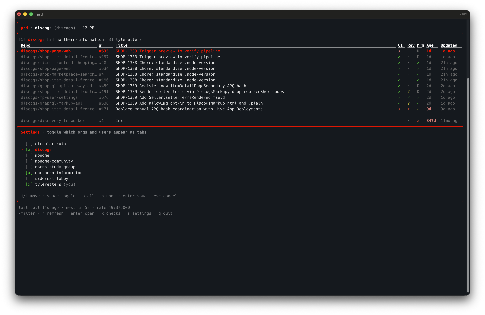

# prd — pull request dashboard



A live terminal dashboard for GitHub PRs across all your orgs. Fresher than the web UI: it polls smart (a cheap "index" query identifies which PRs actually changed; only those get detail fetches), shows freshness in the UI so you can see it's alive, and stays out of your way otherwise.

## Why not just use `gh pr list`?

`gh pr list` is great for one-shot output. `prd` is for the case where you want to _leave a terminal pane open_ with live PR state — across multiple orgs, with CI/review/merge state visible at a glance, without manually refreshing. Think of it as the dashboard GitHub's web UI should be.

## Install

```zsh
npm i -g @northern-information/pr-dashboard
```

Requirements:

- **Node 22 or newer** — check with `node --version`. Anything `>=22` works at runtime (Ink 5 sets the floor). Contributors pin an exact patch via `.node-version` / `.nvmrc` for dev reproducibility; consumers only need the floor.
- **`gh` CLI** installed and authenticated — `brew install gh && gh auth login`

That's it. The tool re-uses your `gh` session, so there's nothing else to configure.

## First run

```zsh
prd
```

On the first launch you'll see the settings panel. Every GitHub org you belong to (plus your own user account) appears as a checkbox, in alphabetical order. Toggle the ones you want to see as tabs and hit `enter`.

After that, `prd` opens straight to the dashboard.

Config lives at `~/.config/pr-dashboard/config.json`. You can edit it by hand, or press `s` inside the app to re-open the settings panel.

## Keys

| Key                   | Action                                    |
| --------------------- | ----------------------------------------- |
| `1`–`9`               | switch scope tab                          |
| `j` / `k` (or arrows) | move cursor                               |
| `enter` / `o`         | open focused PR in browser                |
| `x`                   | toggle failed-checks panel for focused PR |
| `/`                   | filter rows                               |
| `r`                   | force refresh                             |
| `s`                   | open settings (toggle scopes on/off)      |
| `q` / `Ctrl+C`        | quit                                      |

### Settings panel keys

| Key           | Action               |
| ------------- | -------------------- |
| `j` / `k`     | move cursor          |
| `space` / `x` | toggle focused scope |
| `a`           | enable all           |
| `n`           | disable all          |
| `enter`       | save and close       |
| `esc`         | cancel               |

## Columns

- **CI**: `✓` success · `✗` failure · `●` pending · `–` none
- **Rev**: `✓` approved · `✗` changes requested · `?` review requested · `·` none
- **Mrg**: `✓` clean · `⚠` blocked/behind · `✗` dirty (conflicts) · `D` draft
- **Age**: days since `createdAt` — red when >7 days
- **Updated**: relative time since `updatedAt`. Ticks live; this is what makes the dashboard feel fresh.

## How freshness works

- **Index tick** (every `indexIntervalMs`, default 20s): one GraphQL `search` query per active scope pulls `{id, updatedAt, headRefOid}` only. Cheap — a few rate-limit points.
- **Detail tick**: a single batched `nodes(ids:)` query fetches the full row only for PRs whose `updatedAt` or `headRefOid` changed since last cycle. So in steady state, an open `prd` costs almost nothing against your 5000-pts/hr GraphQL budget.
- The status footer shows `last poll Ns ago / next in Ns / rate <remaining>/5000` so you can always see it's alive.
- Org membership is re-checked on every launch — join a new org, restart `prd`, and it shows up in settings.

## Configuration

`~/.config/pr-dashboard/config.json`:

```json
{
  "indexIntervalMs": 20000,
  "detailMaxBatchSize": 25,
  "enabledScopes": ["discogs", "northern-information"],
  "disabledScopes": [],
  "columns": ["repo", "number", "title", "ci", "review", "merge", "age", "updated"]
}
```

- `enabledScopes` — org slugs (or your user login) that should appear as tabs.
- `disabledScopes` — scopes you've explicitly hidden. Newly-discovered orgs default to _enabled_ unless they appear here.
- Both lists are managed by the in-app settings panel. Editing the file by hand also works.

Each scope renders as a single GitHub search query: `is:open is:pr involves:@me <user-or-org>:<key> archived:false` — meaning authored, review-requested, mentioned, or assigned.

## Update notifications

When a newer version is published to npm, `prd` shows a one-line banner in brand red at the bottom of the dashboard with the upgrade command. The check runs once a day in an unref'd background process, so it never blocks startup. To silence it, set `NO_UPDATE_NOTIFIER=1` in your shell environment.

## Develop

```zsh
git clone git@github.com:northern-information/pr-dashboard.git
cd pr-dashboard
npm ci           # reproducible install from package-lock.json
npm link         # makes `prd` resolve to your local checkout
prd
```

Use `npm install` only when you're changing `package.json` (adding, removing, or bumping a dep). For everything else — initial clone, switching branches, CI — `npm ci` is faster and never silently mutates the lockfile.

Scripts:

```zsh
npm run dev            # run via tsx
npm run test           # vitest
npm run test:coverage  # vitest with v8 coverage report
npm run typecheck      # tsc --noEmit
npm run lint           # eslint
npm run verify         # typecheck + lint + test (CI gate)
```

Coverage thresholds: 90% statements / 80% branches / 90% functions / 90% lines on the unit-testable modules (`src/config`, `src/poll`, `src/format`). UI components are excluded — they're tested at integration level. CI runs `npm run test:coverage` on every push and uploads the HTML report as a workflow artifact.

## Release

Maintainer notes — direct pushes to `main` are blocked by branch protection, so releases go through a PR:

```zsh
git switch -c chore/vX.Y.Z
npm version patch --no-git-tag-version   # bumps package.json (or minor / major)
git commit -am "chore: vX.Y.Z"
git push -u origin chore/vX.Y.Z
gh pr create --fill --base main
# wait for CI green, then:
gh pr merge --squash --delete-branch

# sync local main, then tag from it
git switch main && git pull --ff-only
git tag vX.Y.Z
git push origin vX.Y.Z
```

Pushing the tag triggers `.github/workflows/publish.yml`, which:

1. Verifies the tag matches `v[0-9]+.[0-9]+.[0-9]+` (semver) — also enforced by a tag-protection ruleset on the GitHub side
2. Verifies the tag matches `package.json` version
3. Publishes to npm via Trusted Publishing (OIDC; no `NPM_TOKEN`)
4. Signs a provenance attestation linking the npm release back to this commit

## License

MIT
